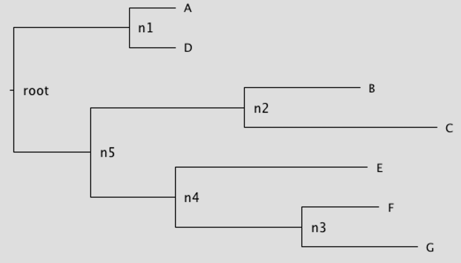

# LSD2: LEAST-SQUARES METHODS TO ESTIMATE RATES AND DATES FROM PHYLOGENIES

## News

- lsd2 is now integrated in [IQ-tree](http://www.iqtree.org)

- For people who prefer R, an R-wrapper of lsd2 can be found here: https://github.com/tothuhien/Rlsd2

- Changing some default setting: Temporal constraint is now imposed by default without option -c. Variance is also used by default without applying -v 1. Outgroups are now by default kept in the tree, to remove them use option -G together with -g

## Compile/install LSD2:

Type __make__ from the folder __src__, you will have the executable file __lsd2__ in the same place.
Note that C++ compiler and library support for the ISO C++ 2011 is required to compile the program from sources. 

Mac/Linux users can install lsd2 via Homebrew as follows (the Homebrew version is not yet updated with the current one on github): `brew install brewsci/bio/lsd2`
     
## Run LSD2:

If you want to use the interface, type __./lsd2__ without parameters in the terminal from the folder containing the executable file.
Otherwise, type __./lsd2 options__  where the list of options can be obtained by __./lsd2 -h__.

The input tree file is required and should be specified by option __-i__. 
	
The input date file is necessary to estimate absolute dates and can be specified by option __-d__. 
The input date file should contain the date of most of the tips and possiblly some internal nodes if known. 
If some tip dates are missing, the program just uses the subtree containing all defined date tips & nodes for estimating the rate. 
The missing tip dates would be inferred at the end using the estimated rate & dates.
In order to avoid undetermined problem, sufficient dates should be given.
A tree where all tips having the same date with no further date information on internal nodes will not be able to infer absolute dates. 
In this case, you can still estimate relative dates using options -a and -z to specify the root date and tip date. 
	
By default, lsd2 imppose the __temporal constraints__ (date of a node >= date of its ancestors) on every node. 
It should be noticed that LSD2 always assumes an increasing-time order from root to tips, i.e the date of a node is smaller than that of its children. If your data has the reverse order, the simplest way is to take the negation of the input date, and take the negation again of the output date to obtain your expected results.

The program first __collapses__ all internal branches that are considered uninformative (<= 0.5/seqlength by default, and low support value if specified) and impose a constraint of __minimum branch length__ for the time scaled tree. This value is rounded to a time unit (day, week, year, My etc ...) based on the __rounding factor__ of option -R. Users should be aware of this to select the right date units for their data if the default one does not fit. These values could be manually specified via option -l (for uninformative branch length threshold), -S (support value threshold), and options -u, -U (for minimum internal/external branches lengths of time scaled tree).

*Note that if the input tree contains lots of null branches, then applying a positive minimum branch length on the time scaled tree could produce biais. In this case, it's suggested to use -u 0 to allow null branches in the out tree. On the other hands, if the input branch lengths are significantly high then you could increase the minimum branch length. Users are encouraged to try different variants to select a good one that fits with their data.*

Further options can be specified, see __./lsd2 -h__ for more details.

## Input files format

### Input_tree_file

Input tree(s) in __newick__ format are compulsory. A tree can be either binary or polytomy - and either having support value or not. The input file must contain one tree per line, for example:

    ((A:0.12,D:0.12):0.3,(B:0.3,C:0.5):0.4);

    ((A:0.12,B:0.3):0.7,(C:0.5,D:0.8):0.1);

### Input_date_file

An input date file is optional. If it's not provided then the program estimates the relative dates by
assuming all tips have the same date (1 by default), and the root has date 0 by default.

A correct date can be a __real__ or a string of format __year-month-day__. Suppose that we have an input ((A:0.12,D:0.12):0.3,(B:0.3,C:0.5):0.4); then an example of
input date file can be as follows:

    5			# number of temporal constraints
    A 1999.2		# the date of A is 1999.2
    B 2000.1		# the date of B is 2000.1
    C l(1990.5)		# the date of C is >= 1990.5 (more recent than 1990.5)
    D b(1998.21,2000.5)	# the date of D is between 1998.21 and 2000.5
    mrca(A,B,C) u(1980)	# the date of the most recent ancestor of A,B, and C is <= 1980 (older than 1980)
    
You can also define the labels for internal nodes and use them to define their dates. 
For example you have an input tree: ((A:0.12,D:0.12)n1:0.3,(B:0.3,C:0.5)n2:0.4); 
then an input date file can be as follows:

    5
    A 2000-07-12
    n1 l(2001-05-11)
    C b(2001-04-11,2004-01-15)
    n2 u(2003-02-12)

If the date format is detected as year-month-day and there're some imprecise dates (missing month, or missing day) then lsd2 automatically turns it into the corresponding interval.

### Given rate file

If the rates are known and you want to use it to infer the dates, then you can 
give them in a file. The file should have each rate per line which corresponds 
to each tree in the Input_tree_file, for example:

	0.0068	
	0.0052

### Outgroup file

	2
	outgroup1
	outgroup2

If there are more than 1 outgroups, than they must be monophyletic in the input trees. By default, the program uses outgroup to root the tree and removes them before dating process. To keep to root in the final tree, use option -k in addition.

### Partition file

You can partition the branch trees into several subsets that you know each subset
has a different rate. 

Suppose that we have a tree `((A:0.12,D:0.12)n1:0.3,((B:0.3,C:0.5)n2:0.4,(E:0.5,(F:0.2,G:0.3)n3:0.33)n4:0.22)n5:0.2)root;` 

then an example for partition file can be as follows:

    group1 1 {n1} {n5 n4}
    group2 1 {n3}

Each line defines a group rate, which contains a list of subtrees whose branches are supposed to have the same substitution rate. It starts by the name of the group (`group1`), then the prior proportion (`1`) of the group rate compared to the main rate. This is just a starting value, and the proportion will be estimated at the end; giving an appropriate value helps to converge faster.
Each subtree is then defined between {}: the first node is the root of the subtree and the following nodes (if there any) define its tips. If the first node is a tip label then it takes the mrca of all tips as the root of the subtree.
If there's only root and not any tip defined, then the subtree is extended down to the tips of the full tree. Hence, {n1} defines the subtree rooted at the node n1; and {n5 n4} defines the subtree rooted at n5 that has one tip as n4 and other tips as the ones of the full trees (here are B,C). 
As a consequence, in this example, the branches will be partitioned into 3 groups such that each group has a different rate: 

- group1: (n1,A), (n1,D), (n5,n4), (n5,n2), (n2,B), (n2,C); 
- group2: (n3,F), (n3,G); 
- group0: the remaining branches of the tree (main rate). 
    
Note that if the internal nodes don't have labels, then they can be defined by mrca of at least two tips, for example n1 is mrca(A,D)

## Using variances

Variance is used to penalize long branch lengths. The variance formula of each branch v_i is proprtion to (b_i + b), where b (specified by option __-b__) is the pseudo constant added to adjust the dependency of variances to branch lengths. This parameter is a positive number, and by defaul is maximum of median branch length and 10/seqlength. It could be adjusted based on how much your input tree is relaxed. The smaller it is, the more variances are linear to branch lengths, which is more appropriate for strict clock tree. The bigger it is the less dependent of branch lengths on variances, which may be better for relaxed tree. Option -v is used to set variance option. __-v 1__ is set by default to use variance. Set __-v 0__ if you don't want to use variance, and __-v 2__ to run program twice where the second time calculates variances based of the estimated branch length of the first time. Simulation shows that -v 2 give slightly better result than -v 1 in average.

## Some examples of command lines:

* If the input tree is rooted:

    - You want to estimate rate & dates (by default under temporal constraints, using variances, your sequence length is 1000):

    `./lsd2 -i rootedtree_file -d date_file -s 1000`
    
    - Similar as above, but you want to force the root date to 0:
    
    `./lsd2 -i rootedtree_file -d date_file -a 0 -s 1000`

	  - You want to remove outlier nodes with Zscore threshold 3:

    `./lsd2 -i rootedtree_file -d date_file -e 3 -s 1000`
  
    - You want to collapse only null branches in the input tree (by default all branches <= 0.5/seqlength are collapsed), and impose a minimum of 0.1 (estimated by default) for the branches of the time scaled tree:
  
    `./lsd2 -i rootedtree_file -d date_file -e 3 -u 0.1 -l 0 -s 1000`
    
    - Similar as above, but you don't want to collapse any branch even null, then set a negative value for option -l:
    
    `./lsd2 -i rootedtree_file -d date_file -e 3 -u 0.1 -l -1 -s 1000`
  
    - Similar as above, but you allow nullability for external branches of output tree:

    `./lsd2 -i rootedtree_file -d date_file -e 3 -u 0.1 -U 0 -l 0 -s 1000`
    
	  - You know the tree partition where each part should have a different rate:

    `./lsd2 -i rootedtree_file -d date_file -p parition_file -s 1000`

	  - You want to re-estimate the root position locally around the given root

    `./lsd2 -i rootedtree_file -d date_file -r l -s 1000`

	  - You want to calculate confidence intervals from 100 simulated trees, and you'd like to apply a lognormal relaxed clock of standard deviation 0.4 to the simulated branch lengths.

    `./lsd2 -i rootedtree_file -d date_file -r l -f 100 -s 1000 -q 0.4`
    
    (To calculate confidence intervals, the sequence length is required via option -s. The program generates simulated branch lengths using Poisson distributions whose mean equal to the estimated ones multiplied with sequence length. In addition, a lognormal relaxed clock is also applied to the branch lengths. This ditribution has mean 1 and standard deviation settable by users with option -q, by default is 0.2; 0 means strict clock. The bigger q is, the more your tree is relaxed and the bigger confidence intervals you should get).

    - You want to calculate confidence intervals from your bootstrap trees.
    
    `./lsd2 -i rootedtree_file -d date_file -f bootstrap.nwk -s 1000`
    

	  - If all tips have the same date (for example 0), and you know the root date (for example -10)
	
	`./lsd2 -i tree_file -a -10 -z 0`

* If the input tree is unrooted, you should either specify outgroups or use option -r to estimate the root position.
	
	- If you don't have any outgroup and you want to estimate the root position:

    `./lsd2 -i unrootedtree_file -d date_file -r a`

	- If you have a list of outgroups and want to use them for rooting:

    `./lsd2 -i unrootedtree_file -d date_file -g outgroup_file`
    
    - If you want to remove the outgroups from the tree:
    
    `./lsd2 -i unrootedtree_file -d date_file -g outgroup_file -G`
    
## Output files: 

*.result* : contain the estimated rates, root date, possibly confidence intervals, outlier nodes and the value of the objective function.

*.nexus* : trees in nexus format which contain information about the dates of internal nodes, branch lengths, and the confidence intervals (if option -f was used).
    
*.date.nexus* : similar to *.nexus* trees, but branch lengths are rescaled to time unit by multiplying to the estimated rate. 

*.nwk* : similar to *.nwk* trees but in newick format, so do not contain confidence intervals information.

## Citation
If you use this software, please cite: “Fast dating using least-squares criteria and algorithms”, T-H. To, M. Jung, S. Lycett, O. Gascuel, Syst Biol. 2016 Jan;65(1):82-97.
